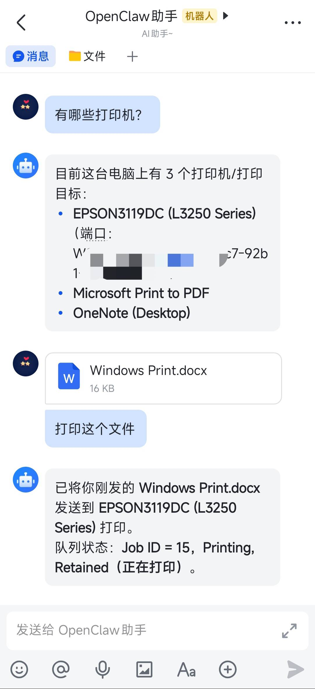
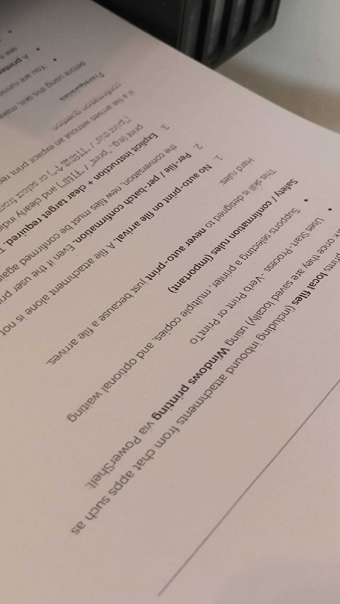

# windows-print

[English](#english) | [中文](#中文)

ClawHub: [clawhub.ai/sqfcyily/windows-print](https://clawhub.ai/sqfcyily/windows-print)

---

## English

### Overview

`windows-print` is a PowerShell-based skill for AI assistants/agents (e.g., **OpenClaw**) to print files on Windows.

Typical use case: a user sends a file in chat apps such as **Feishu/Lark** or **WeCom (WeChat Work)** → the agent receives it as a local attachment path → after the user explicitly asks to print, the agent uses this skill to queue a Windows print job.

It uses Windows shell printing verbs (`Print` / `PrintTo`) and supports selecting a printer, multiple copies, and optionally waiting for the spawned print process.

### Prerequisites (required)

- **Windows** environment.
- The user has already **connected/installed a printer**, and Windows can see it.
- The file types to print (PDF/DOCX/PNG/…) have a working **Windows file association** that supports printing (printing relies on the associated application).

### Safety / confirmation rules (important)

This skill is designed to never print unless the user explicitly asks to print.

1. No auto-print on file arrival.
2. Confirm per file / per batch.
3. Require an explicit print instruction and a clear target (which attachment(s) to print).

### ClawHub / text-only packaging note

Some upload validators treat `.ps1` as “non-text”. To keep this skill publishable as text-only:

- The PowerShell scripts are stored as `.ps1.txt` under `scripts/`.
- The runner should execute them by loading the text and invoking it as a `ScriptBlock` (see `SKILL.md`).

### Sample

  
  

### Notes / troubleshooting

- If printing silently fails, open the file manually and print once to confirm the associated app supports printing.
- `PrintTo` may fail for some file types/apps; the script falls back to the default printer.

---

## 中文

### 概述

`windows-print` 是一个面向 AI 助手/智能体（如 **OpenClaw**）的 skill，用于在 Windows 上把用户发来的文件打印出来。

常见场景：用户在 **飞书/企业微信** 等聊天软件发送附件 → AI 在本地获取到附件路径 → 在用户明确要求“打印”后，调用该 skill 生成 Windows 打印任务。

它通过 PowerShell 调用 Windows 的外壳打印动词（`Print` / `PrintTo`）发起打印，支持指定打印机、份数，以及可选等待打印进程退出。

### 前置条件（必须）

- 运行环境为 **Windows**。
- 用户已提前 **连接/安装好打印机**，并且 Windows 能识别到。
- 需要打印的文件类型（PDF/DOCX/PNG/…）在 Windows 中已配置好正确的**默认打开程序/文件关联**，且该程序支持打印（打印依赖关联应用）。

### 安全/确认规则（很重要）

本技能的设计目标是：只有在用户明确提出“打印”时才允许打印。

1. 仅收到文件不会自动打印。
2. 必须逐文件/逐批次确认。
3. 必须同时满足：明确的打印指令 + 明确的打印目标（要打印哪些附件）。

### ClawHub / 纯文本打包说明

部分上传校验会把 `.ps1` 视为“非文本”。为保证可上传为纯文本：

- PowerShell 脚本以 `.ps1.txt` 形式存放在 `scripts/` 下。
- 执行端应读取文本并用 `ScriptBlock` 方式执行（参考 `SKILL.md`）。

### 示例图

  
  

### 备注/排错

- 如果没有反应，先手动打开文件打印一次，确认默认打开程序确实支持打印。
- `PrintTo` 在某些文件类型/应用里可能失败；脚本会回退到默认打印机。
